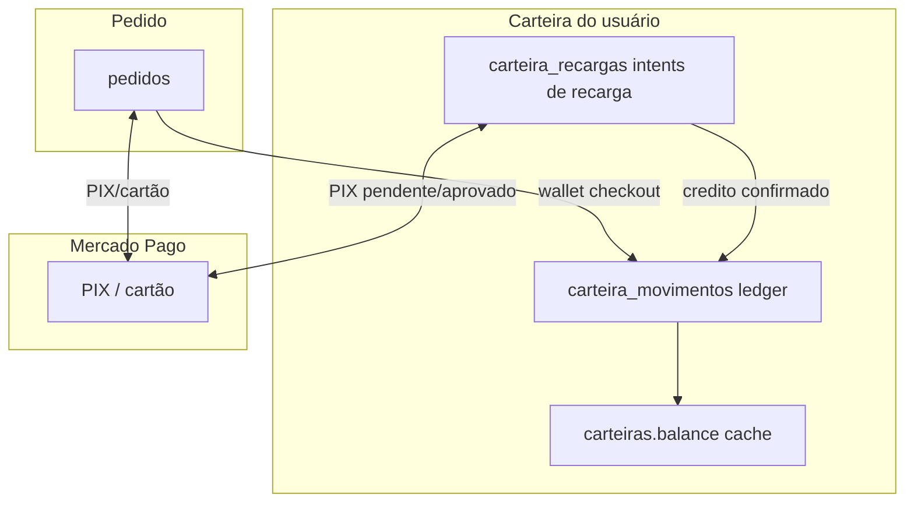
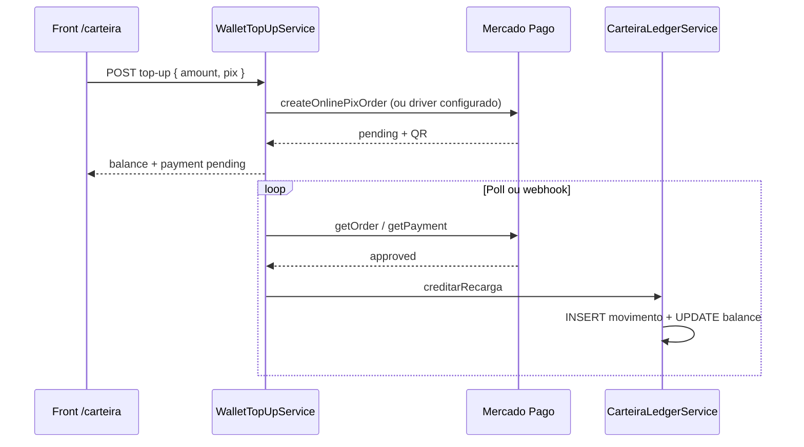
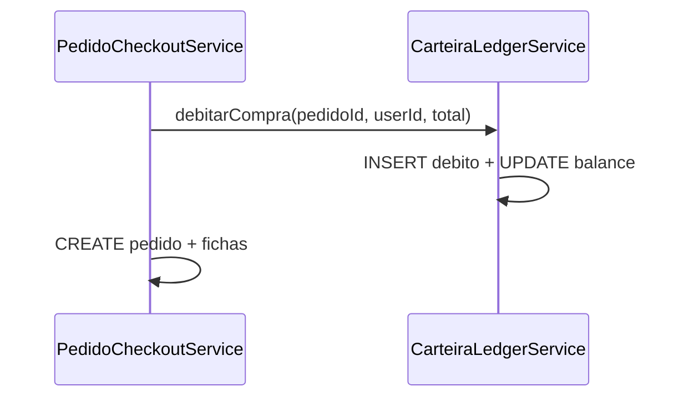

# Carteira, ledger e pagamentos

Documento de contexto para agentes e desenvolvedores. Descreve o modelo de dados, serviços e fluxos **implementados** na API em relação à Carteira do Consumidor, recarga via Mercado Pago e checkout de Pedidos.

**Última revisão:** 2026-07-06

**Referências:** `CONTEXT.md`, `docs/adr/0004-pagamento-fichas-e-handoff-e2e.md`, `docs/roadmap-mercado-pago.md`, `docs/integrations/mercadopago-qr-orders.md`

---

## Vocabulário (domínio)

| Termo | Significado |
|-------|-------------|
| **Carteira** | Saldo pré-pago do Usuário (`carteiras.balance`). Meio de pagamento no checkout (`paymentMethod: wallet`). |
| **Recarga** | Crédito adicionado à Carteira via gateway (hoje: só PIX). Fluxo separado do checkout de Pedido. |
| **Movimentação** | Linha imutável no ledger (`carteira_movimentos`). Toda alteração de saldo passa por aqui. |
| **Pagamento confirmado** | Gatilho para crédito na recarga ou emissão de Fichas no pedido. Ver ADR-0004. |

Evitar em copy de produto: *wallet*, *top-up*, *ledger* ? preferir **Carteira**, **Recarga**, **Movimentações**.

---

## Visão geral



**Regra central:** `carteiras.balance` é **cache**. O único serviço que altera saldo é `CarteiraLedgerService`. Movimentos são **append-only** (sem `updated_at`).

---

## Tabelas

### `carteiras`

| Coluna | Descrição |
|--------|-----------|
| `user_id` | PK, FK ? `users` |
| `balance` | Saldo atual (decimal). Atualizado junto com cada movimento. |

### `carteira_recargas`

Registro de **tentativa de recarga** (intent + estado do gateway).

| Coluna | Descrição |
|--------|-----------|
| `id` | `recarga-{ulid}` |
| `user_id` | FK |
| `amount` | Valor da recarga |
| `payment_method` | Hoje: `pix` |
| `payment_status` | `pending`, `paid`, `failed` |
| `gateway_payment_id`, `gateway_order_id` | IDs Mercado Pago |
| `pix_qr_code`, `pix_copy_paste`, `pix_expires_at` | Dados PIX para o front |
| `credited_at` | Quando o saldo foi creditado (null = ainda não entrou no ledger) |

Migration: `2026_07_06_220000_create_carteira_recargas_table.php`

### `carteira_movimentos` (ledger)

| Coluna | Descrição |
|--------|-----------|
| `id` | `mov-{ulid}` |
| `user_id` | FK |
| `direction` | `credito` \| `debito` |
| `tipo` | `recarga` \| `compra` (futuro: `estorno_recarga`, `estorno_compra`, `ajuste`) |
| `amount` | Sempre positivo |
| `saldo_apos` | Saldo da carteira após este movimento |
| `origem_tipo` | `recarga` \| `pedido` \| `manual` |
| `origem_id` | ID da recarga ou do pedido |
| `descricao` | Texto para extrato |
| `idempotency_key` | **UNIQUE** ? evita duplo crédito/débito |
| `metadata` | JSON opcional (gateway IDs, etc.) |
| `created_at` | Imutável (sem `updated_at`) |

Migration: `2026_07_06_230000_create_carteira_movimentos_table.php`

### `cartoes_salvos`

Cartões tokenizados para checkout e recarga. Ver **Cartão salvo** em `CONTEXT.md`.

#### Exposição na API (front autenticado, dono do cartão)

| Campo JSON | Origem | Pode expor? |
|------------|--------|-------------|
| `id` | PK local (`card-{ulid}`) | Sim |
| `brand`, `lastFour`, `holderName`, `isDefault` | Metadados de exibição | Sim |
| `mercadoPagoCardId` | `gateway_token` (referência MP para re-tokenização no browser) | Sim ? só rotas autenticadas do próprio usuário |
| `gateway_token` (nome interno) | Mesmo valor; preferir `mercadoPagoCardId` no JSON | Não usar esse nome na API pública |

**Nunca** enviar em resposta, log ou webhook: PAN, CVV, validade completa, `cardToken` one-shot, `MP_ACCESS_TOKEN`.

**Re-tokenização no checkout:** o front usa `mercadoPagoCardId` + CVV via MercadoPago.js ? gera `cardToken` fresh ? envia `cardId` (local) + `cardToken` ao backend. O backend valida ownership do `cardId` e cobra com o token one-shot (mesmo fluxo de cartão novo).

**Limite:** máximo **5** cartões salvos por Usuário. `POST /api/user/wallet/cards` retorna `422` se o limite for atingido (validar antes de chamar o MP).

**Cartão padrão (`is_default`):** o primeiro cartão salvo vira padrão; os seguintes ficam `is_default: false`. Ao remover o padrão, promove o cartão restante mais antigo. Trocar padrão manualmente fica fora do MVP.

**Sem `MP_ACCESS_TOKEN`:** `POST` e `DELETE /api/user/wallet/cards` retornam `422` (MP não configurado). `GET /api/user/wallet` continua listando seed em dev. Checkout com `cardId` mantém stub local só sem MP (legado dev).

**Duplicata:** rejeitar com `422` se o Usuário já tiver cartão com mesma `brand` + `last_four` (validar antes de chamar o MP).

---

## Chaves de idempotência

| Operação | `idempotency_key` |
|----------|-------------------|
| Crédito de recarga | `recarga:{recarga_id}:credito` |
| Débito de pedido com carteira | `pedido:{pedido_id}:debito` |

Se a chave já existe, `CarteiraLedgerService` retorna o movimento existente sem alterar saldo novamente.

---

## Serviços

### `CarteiraLedgerService` ? **único ponto de alteração de saldo**

| Método | Uso |
|--------|-----|
| `creditarRecarga(CarteiraRecarga)` | PIX/cartão de recarga aprovado ? movimento `credito/recarga` |
| `debitarCompra(pedidoId, userId, amount)` | Checkout `wallet` ? movimento `debito/compra` |

Fluxo interno (`registrarMovimento`):

1. `lockForUpdate` na carteira
2. Verifica idempotência
3. Valida saldo (débito)
4. Insere `carteira_movimentos` com `saldo_apos`
5. Atualiza `carteiras.balance`

### `WalletTopUpService`

- `POST /api/user/wallet/top-up`
- Valida `amount` (1?10000) e `paymentMethod: pix`
- Exige CPF no perfil (mesma regra do checkout gateway)
- Chama Mercado Pago (mesmos drivers PIX do pedido: `online`, `orders`, `payments`)
- Cria `carteira_recargas`
- Se pagamento já aprovado na hora ? `CarteiraLedgerService::creditarRecarga`

### `PedidoCheckoutService`

- `POST /api/events/{eventId}/pedidos`
- Meios: `credit_card`, `pix`, `wallet`
- **`wallet`:** `CarteiraLedgerService::debitarCompra` com `pedidoId` (ULID gerado antes do insert)
- Fichas só geradas quando `payment_status === paid` (ADR-0004)

### `PaymentSyncService`

- Poll (`GET /api/payments/{id}/status`) e webhook Mercado Pago
- **Pedido:** sincroniza gateway ? `PedidoFulfillmentService` (fichas)
- **Recarga:** sincroniza gateway ? `CarteiraLedgerService::creditarRecarga` quando `credited_at` ainda é null

### `PaymentConfigService`

`GET /api/payments/config` expõe:

- `enabled`, `publicKey` (SDK JS)
- `pixEnabled`, `topUpEnabled` (requer `MP_ACCESS_TOKEN`)
- `cardEnabled`

---

## Rotas da Carteira e pagamentos

| Método | Rota | Auth | Descrição |
|--------|------|------|-----------|
| `GET` | `/api/user/wallet` | Sanctum | Saldo + cartões salvos |
| `POST` | `/api/user/wallet/top-up` | Sanctum | Inicia recarga (PIX) |
| `GET` | `/api/payments/config` | ? | Config pública MP |
| `GET` | `/api/payments/{paymentId}/status` | Sanctum | Poll pedido **ou** recarga |
| `POST` | `/api/webhooks/mercadopago` | ? | Notificações MP |
| `POST` | `/api/events/{eventId}/pedidos` | Sanctum | Checkout (inclui `wallet`) |

### Contrato `POST /api/user/wallet/top-up`

**Request:**

```json
{
  "amount": 50,
  "paymentMethod": "pix"
}
```

**Response (201):**

```json
{
  "balance": 46,
  "payment": {
    "paymentId": "PAY...",
    "status": "pending",
    "method": "pix",
    "pix": {
      "qrCode": "...",
      "copyPaste": "...",
      "expiresAt": "..."
    }
  }
}
```

`balance` na resposta é o saldo **antes** do crédito enquanto PIX estiver pendente.

---

## Fluxos

### Recarga PIX



### Checkout com saldo da Carteira



Tudo na mesma transação DB do checkout.

---

## Modelos Eloquent

| Model | Arquivo |
|-------|---------|
| `Carteira` | `app/Models/Carteira.php` |
| `CarteiraRecarga` | `app/Models/CarteiraRecarga.php` |
| `CarteiraMovimento` | `app/Models/CarteiraMovimento.php` |
| `CartaoSalvo` | `app/Models/CartaoSalvo.php` |

`Carteira::movimentos()` ? relação HasMany para extrato futuro.

---

## Front-end (referência)

| Peça | Caminho |
|------|---------|
| Página Carteira | `FichAqui-FrontEnd/app/(consumer)/carteira/page.tsx` |
| Diálogo recarga (só PIX) | `FichAqui-FrontEnd/components/payments/wallet-top-up-dialog.tsx` |
| API client | `FichAqui-FrontEnd/lib/api/wallet.ts` |
| Poll PIX | `FichAqui-FrontEnd/lib/hooks/use-payment-status-poll.ts` |

Aba **Movimentações** ainda é placeholder ? aguarda `GET /api/user/wallet/transactions`.

---

## Testes

| Arquivo | Cobertura |
|---------|-----------|
| `tests/Feature/WalletTest.php` | `GET /api/user/wallet` |
| `tests/Feature/WalletTopUpTest.php` | Recarga PIX, ledger em aprovação |
| `tests/Feature/CheckoutTest.php` | Débito ledger no checkout `wallet` |
| `tests/Feature/Adr0004HandoffTest.php` | PIX/cartão em pedidos, webhooks |

---

## O que ainda não está implementado

| Item | Notas |
|------|-------|
| `GET /api/user/wallet/transactions` | Extrato para aba Movimentações |
| Recarga via cartão | Front tinha UI; backend retorna 422 para `credit_card` |
| `POST /api/user/wallet/cards` | Rota referenciada no front; controller não exposto |
| Estornos (`estorno_recarga`, `estorno_compra`) | Tipos reservados no desenho do ledger |
| Backfill de movimentos | Saldos do `WalletSeeder` (ex.: R$ 46) existem sem histórico pré-ledger |
| Reconciliação automática | Job comparando `balance` vs soma de movimentos |
| OpenAPI | `public/openapi.yaml` ainda sem `top-up` e `transactions` |

---

## Configuração Mercado Pago

Variáveis relevantes (`config/mercadopago.php`):

| Variável | Uso |
|----------|-----|
| `MP_ACCESS_TOKEN` | Obrigatório para PIX/recarga e sync |
| `MP_PUBLIC_KEY` | SDK JS no front (cartão) |
| `MP_PIX_DRIVER` | `online` (default), `orders`, `payments` |
| `MP_SANDBOX` | Em sandbox, e-mail deve ser `@testuser.com` |

---

## Checklist para novas solicitações

Ao estender a Carteira:

1. **Nunca** atualizar `carteiras.balance` fora de `CarteiraLedgerService`.
2. Toda nova forma de entrada/saída de saldo ? novo `tipo` em `carteira_movimentos` + `idempotency_key` único.
3. Pagamentos assíncronos (PIX) ? registrar intent (`carteira_recargas` ou `pedidos`) e creditar/debitar só após confirmação.
4. Poll e webhook devem ser **idempotentes** (`credited_at` na recarga; `idempotency_key` no ledger).
5. Manter contrato do `FrontendPresenter` para campos `payment`, `pix`, `paymentId`, `status`.

---

## Migrations relacionadas

```
2026_06_17_250000_create_wallet_tables.php          # carteiras, cartoes_salvos
2026_07_06_220000_create_carteira_recargas_table.php
2026_07_06_230000_create_carteira_movimentos_table.php
```

Comando:

```bash
php artisan migrate
```
