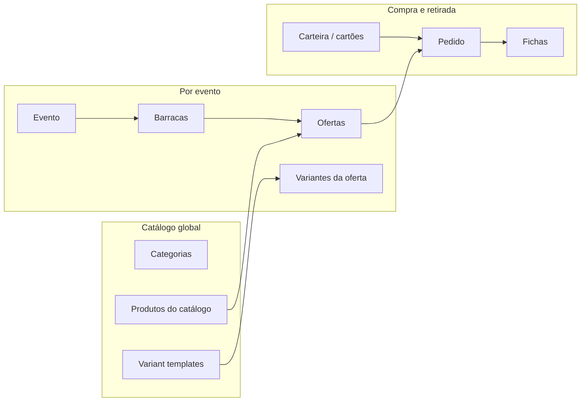
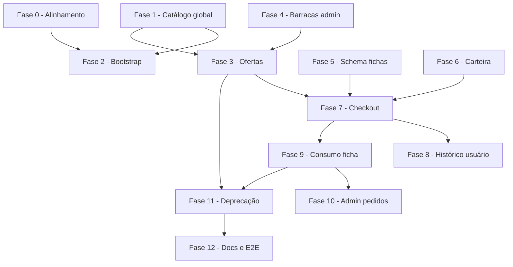

# Roadmap de desenvolvimento ? API conforme `backend-integration-guide`

Este documento descreve o plano para o **FichAqui-BackEnd** cumprir todos os requisitos definidos em [`FichAqui-FrontEnd/backend-integration-guide.md`](../../FichAqui-FrontEnd/backend-integration-guide.md).

**Referências:** `CONTEXT.md`, ADR-0001 (evento unificado com estabelecimento), `public/openapi.yaml`.

**Última revisão:** 2026-06-17.

---

## Estado atual (baseline)

| Módulo | Situação |
|--------|----------|
| Autenticação | `login`, `me`, `logout`; `me` expõe `role` + `roles[]` alias |
| Bootstrap | `GET /api/bootstrap` híbrido; `GET /api/catalog` com catálogo global |
| Eventos | CRUD de leitura + `POST`/`PATCH` implementados |
| Barracas | `GET`/`POST`/`PATCH` por evento; criacao tambem em `POST /api/events` |
| Cardápio | `GET .../offerings` + legado `menu-products` (deprecado) |
| Pedidos | Checkout com ofertas + fichas; historico em `/api/user/pedidos` e `/api/user/fichas` |
| Carteira | `GET /api/user/wallet` com saldo e cartoes salvos (stub local) |

**Modelo de dados atual:** `eventos`, `barracas`, `produtos`, `sub_produtos`, `pedidos`, `pedido_itens`, `categorias`, `catalogo_produtos`, `variant_templates`, `ofertas`, `oferta_variantes`, `fichas`, `carteiras`, `cartoes_salvos`.  
**Ausente:** consumo de ficha na barraca (Fase 9); deprecacao legado (Fase 11).

---

## Visão do domínio alvo



**Regra central (fichas):** `quantity: N` em um item gera **N fichas** com QR único; consumo marca **uma** ficha; quando todas as fichas do pedido estão `delivered`, o pedido vira `delivered`.

---

## Fases de entrega

Ordem sugerida: fundação de domínio ? rotas públicas ? gestão admin ? checkout ? retirada ? limpeza legado.

---

### Fase 0 ? Alinhamento rápido (sem migração de schema) ? **Realizada**

**Objetivo:** reduzir atrito com o front enquanto as fases seguintes avançam.

| # | Entrega | Detalhes |
|---|---------|----------|
| 0.1 | DTO `GET /api/auth/me` | Expor `role` principal (`consumer` \| `admin` \| `organizer` \| `stall_manager`) derivado de `roles[]`; manter `roles` como alias opcional durante transição |
| 0.2 | Documentar rotas legadas | Marcar `menu-products` e `PATCH /pedidos/{id}/status` como `@deprecated` no OpenAPI com data de remoção |
| 0.3 | Testes de contrato mínimos | Feature tests que assertam shape JSON dos endpoints já existentes |

**Critério de pronto:** front consegue ler `role` sem adaptação; Swagger documenta deprecações.

---

### Fase 1 ? Schema: catálogo global ? **Realizada**

**Objetivo:** separar **Produto de catálogo** (plataforma) de **Oferta** (por barraca/evento).

#### Migrations

| Tabela | Campos principais |
|--------|-------------------|
| `categorias` | `id`, `name`, `icon`, `color` |
| `catalogo_produtos` | `id`, `categoria_id`, `name`, `description`, `image` |
| `variant_templates` | `id`, `catalogo_produto_id`, `label` |

#### Código

- Models: `Categoria`, `CatalogoProduto`, `VariantTemplate`
- Seeder: popular categorias e produtos base (Pastel, Milho, etc.)
- `FrontendPresenter::categoria()`, `::catalogProduct()`

#### Testes

- Seeder idempotente; listagem via query direta nos testes

**Critério de pronto:** dados de catálogo global persistidos e apresentáveis no DTO do guia.

---

### Fase 2 ? Bootstrap e catálogo (`GET /api/bootstrap`, `GET /api/catalog`) ? **Realizada**

**Objetivo:** rota pública com `categories` + `catalogProducts` (+ `variantTemplates`).

| # | Entrega |
|---|---------|
| 2.1 | Refatorar `BootstrapController` para o contrato do guia |
| 2.2 | Adicionar `GET /api/catalog` como alias (mesmo handler ou redirect interno) |
| 2.3 | Decidir payload híbrido de transição | ? Híbrido em `/bootstrap`; `/catalog` só contrato novo |
| 2.4 | Atualizar `openapi.yaml` (`BootstrapResponse`) |

**Critério de pronto:** resposta JSON bate com seção 3 do guia; testes Feature cobrem estrutura.

---

### Fase 3 ? Schema e rotas: ofertas (`Offering`) ? **Realizada**

**Objetivo:** substituir o acoplamento evento-produto-subproduto por ofertas referenciando o catálogo.

#### Migrations

| Tabela | Campos principais |
|--------|-------------------|
| `ofertas` | `id`, `evento_id`, `barraca_id`, `catalogo_produto_id`, `available` |
| `oferta_variantes` | `id`, `oferta_id`, `variant_template_id`, `price`, `available` |

> **Nota:** manter `produtos`/`sub_produtos` até Fase 8; popular `ofertas` via migration de dados ou seeder de compatibilidade.

#### Rotas

| Método | Rota | Auth |
|--------|------|------|
| `GET` | `/api/events/{eventId}/offerings` | Público |
| `PUT` | `/api/events/{eventId}/stalls/{stallId}/offerings` | Organizador da barraca/evento |

#### Código

- `OfferingController` (ou métodos em `EventController`/`StallController`)
- `OfferingWriteService` para upsert do array de ofertas
- `FrontendPresenter::offering()`
- Autorização via `OrganizerAuthorization` (mesmo padrão de eventos)

#### Testes

- Listagem pública por evento
- PUT substitui cardápio da barraca
- Validação: `productId`/`templateId` devem existir no catálogo global

**Critério de pronto:** front cruza `productId` das ofertas com `catalogProducts` do bootstrap.

---

### Fase 4 ? Gestão de barracas (admin) ? **Realizada**

**Objetivo:** CRUD de barracas independente da criação de evento.

| Método | Rota | Auth |
|--------|------|------|
| `POST` | `/api/events/{eventId}/stalls` | Organizador |
| `PATCH` | `/api/events/{eventId}/stalls/{stallId}` | Organizador |

#### Código

- `StallController` ou métodos dedicados em `EventController`
- `BarracaWriteService` (create/update status, responsible, color, stock)
- Request validation (Form Request)
- Ajustar `EventoWriteService::create` para não ser o único caminho de criação de barraca (ou delegar para o mesmo service)

#### Testes

- Criar barraca em evento existente
- Fechar barraca (`status: closed`) e garantir que `GET .../stalls` ainda retorna (front filtra)

**Critério de pronto:** seções 5.1 e 5.2 do guia cobertas.

---

### Fase 5 ? Schema: fichas e pagamento ? **Realizada**

**Objetivo:** suportar unidade de retirada individual e checkout com método de pagamento.

#### Migrations

| Tabela | Campos principais |
|--------|-------------------|
| `fichas` | `id`, `pedido_id`, `oferta_variante_id` (ou snapshot), `qr_code`, `status`, `item_name`, `item_image`, `barraca_id`, timestamps |
| `pedidos` (alter) | `payment_method`, `card_id` nullable, `payment_status` opcional |

#### Código

- Model `Ficha` com status `available` \| `delivered`
- `FichaFactory` / geração no `PedidoCheckoutService`:
  - Para cada linha do pedido, criar `quantity` fichas com QR único
- Snapshot em ficha (nome, imagem, barraca) para histórico imutável

#### Testes

- Pedido com `quantity: 3` gera exatamente 3 fichas
- QR codes únicos por ficha

**Critério de pronto:** fichas persistidas; regra de quantidade coberta por testes.

---

### Fase 6 ? Schema: carteira do usuário ? **Realizada**

**Objetivo:** `GET /api/user/wallet`.

#### Migrations

| Tabela | Campos principais |
|--------|-------------------|
| `carteiras` | `user_id`, `balance` (decimal) |
| `cartoes_salvos` | `id`, `user_id`, `brand`, `last_four`, `holder_name`, `is_default`, token/gateway ref (não PAN) |

#### Rotas

| Método | Rota | Auth |
|--------|------|------|
| `GET` | `/api/user/wallet` | Sanctum |

#### Código

- `WalletController`
- `FrontendPresenter::wallet()`, `::savedCard()`
- Seeder: carteira e cartão de teste para usuário consumidor

> **Escopo MVP:** saldo e cartões são dados locais (sem gateway real). Integração PSP fica fora deste roadmap, salvo stub de `paymentMethod` no checkout.

**Critério de pronto:** seção 2.3 do guia atendida.

---

### Fase 7 ? Checkout completo (`POST /api/events/{eventId}/pedidos`) ? **Realizada**

**Objetivo:** pedido com ofertas, pagamento e resposta com fichas.

#### Request (guia)

```json
{
  "items": [{ "offeringId", "variantId", "quantity" }],
  "paymentMethod": "credit_card",
  "cardId": "card-1"
}
```

#### Response (guia)

Pedido + `items` resumidos + array `fichas`.

#### Código

- `PedidoCheckoutService`:
  - Validar ofertas/variantes do evento
  - Calcular total
  - Validar `paymentMethod` / `cardId` (cartão deve pertencer ao usuário)
  - Debitar carteira ou registrar pagamento stub
  - Criar pedido, itens e fichas em transação DB
- Refatorar `PedidoController::store` para usar ofertas (aceitar `offeringId`/`variantId`; deprecar `subProdutoId`)
- `FrontendPresenter::pedido()` inclui `fichas` e items resumidos (`name`, `quantity`, `stallName`)

#### Testes

- Checkout autenticado gera fichas na resposta
- Item indisponível retorna 422
- Cartão de outro usuário retorna 403/422

**Critério de pronto:** seção 7.1 do guia atendida ponta a ponta.

---

### Fase 8 ? Histórico do consumidor ? **Realizada**

**Objetivo:** rotas escopadas ao usuário autenticado.

| Método | Rota | Descrição |
|--------|------|-----------|
| `GET` | `/api/user/pedidos` | Todos os pedidos do usuário (fichas opcionais) |
| `GET` | `/api/user/fichas` | Fichas com `status: available` |

#### Código

- `UserPedidoController` / `UserFichaController` (ou namespace `Api/User/`)
- Scopes em `Pedido::forUser()`, `Ficha::availableForUser()`
- Paginação opcional (`?page=`) se volume crescer

#### Testes

- Usuário A não vê pedidos/fichas do usuário B
- `GET /api/user/fichas` não retorna fichas `delivered`

**Critério de pronto:** seções 7.2 e 7.3 do guia atendidas.

---

### Fase 9 ? Consumo de ficha na barraca (crítico) ? **Realizada**

**Objetivo:** marcar **uma** ficha como entregue e propagar status ao pedido.

| Método | Rota | Auth |
|--------|------|------|
| `PATCH` | `/api/fichas/{fichaId}/status` | `stall_manager` / organizador |
| *ou* `POST` | `/api/fichas/{fichaId}/consume` | idem |

**Body:** `{ "status": "delivered" }` ou sem body no `consume`.

#### Regra de negócio

1. Atualizar apenas a ficha alvo.
2. Se **todas** as fichas do `pedido_id` estão `delivered` ? `pedidos.status = delivered`.
3. Idempotência: segunda leitura do mesmo QR retorna 200 com estado atual (ou 409 documentado).

#### Código

- `FichaConsumeService` com lock/transação
- Autorização: atendente da barraca da ficha ou organizador do evento
- Busca por `qrCode` (query param opcional `?qr=`) para fluxo de scanner

#### Testes

- 2 fichas no pedido: consumir 1 ? pedido continua `available`
- Consumir a 2ª ? pedido vira `delivered`
- Consumo por QR inexistente ? 404

**Critério de pronto:** seção 7.5 e regra core do guia cobertas.

---

### Fase 10 ? Painel admin de pedidos (ajuste) ? **Realizada**

**Objetivo:** `GET /api/events/{eventId}/pedidos` alinhado ao DTO do guia.

| # | Entrega |
|---|---------|
| 10.1 | Incluir resumo de items no formato do guia |
| 10.2 | Opcional: incluir contagem de fichas por status |
| 10.3 | Restringir a organizadores (`auth:sanctum` + `OrganizerAuthorization`) se ainda estiver público |

**Critério de pronto:** seção 7.4 atendida com DTO consistente com checkout.

---

### Fase 11 ? Deprecação do legado ? **Realizada**

**Objetivo:** remover divergências entre guia e implementação antiga.

| Ação | Detalhe |
|------|---------|
| Remover | `GET /api/events/{eventId}/menu-products` |
| Remover | `PATCH /api/pedidos/{pedidoId}/status` (substituído por consumo de ficha) |
| Migrar dados | Script: `produtos`/`sub_produtos` ? `ofertas`/`oferta_variantes` |
| Dropar tabelas | `produtos`, `sub_produtos` após migração validada |
| Bootstrap | Remover chaves legadas (`menuProducts`, `orders` no bootstrap público) |

**Critério de pronto:** apenas rotas do guia permanecem; seeders e testes atualizados.

---

### Fase 12 ? Documentação, observabilidade e integração ? **Realizada**

| # | Entrega |
|---|---------|
| 12.1 | `public/openapi.yaml` completo (todas as rotas e schemas do guia) |
| 12.2 | Suite Feature cobrindo happy path E2E: bootstrap ? offerings ? checkout ? consume |
| 12.3 | Atualizar `CONTEXT.md` com **Ficha**, **Oferta**, **Catálogo global** (vocabulário de negócio) |
| 12.4 | ADR-0002: catálogo global vs produto por evento (decisão de migração) |
| 12.5 | Checklist de integração com `FichAqui-FrontEnd` (trocar mocks por API real) |

---

## Matriz de rastreabilidade (guia ? fase)

| Endpoint (guia) | Fase |
|-----------------|------|
| `POST /api/auth/login` | ? já existe |
| `GET /api/auth/me` | 0 |
| `GET /api/user/wallet` | 6 |
| `GET /api/bootstrap` / `/api/catalog` | 2 |
| `GET /api/events` | ? já existe |
| `GET /api/events/{eventId}` | ? já existe |
| `POST /api/events` | ? já existe |
| `PATCH /api/events/{eventId}` | ? já existe |
| `GET /api/events/{eventId}/stalls` | ? já existe |
| `POST /api/events/{eventId}/stalls` | 4 |
| `PATCH /api/events/{eventId}/stalls/{stallId}` | 4 |
| `GET /api/events/{eventId}/offerings` | 3 |
| `PUT /api/events/{eventId}/stalls/{stallId}/offerings` | 3 |
| `POST /api/events/{eventId}/pedidos` | 7 (+ 5) |
| `GET /api/user/pedidos` | 8 |
| `GET /api/user/fichas` | 8 |
| `GET /api/events/{eventId}/pedidos` | 10 |
| `PATCH /api/fichas/{fichaId}/status` / `POST .../consume` | 9 |

---

## Dependências entre fases



**Paralelizável:** Fase 4 (barracas) e Fase 6 (carteira) podem avançar em paralelo após Fase 1. Fase 5 (schema fichas) deve preceder Fase 7.

---

## Estimativa de esforço (ordem de grandeza)

| Fase | Complexidade | Notas |
|------|--------------|-------|
| 0 | Baixa | 0,5?1 dia |
| 1?2 | Média | 2?3 dias |
| 3?4 | Média?alta | 3?4 dias |
| 5?7 | Alta | 4?6 dias (núcleo do produto) |
| 8?9 | Média | 2?3 dias |
| 10?12 | Baixa?média | 2?3 dias |

**Total aproximado:** 14?20 dias de desenvolvimento focado (1 dev), sem integração de gateway de pagamento real.

---

## Riscos e decisões em aberto

| Tópico | Opções | Recomendação |
|--------|--------|--------------|
| Migração `Produto` ? `Offering` | Big bang vs convivência | ? Convivência; `OfferingSeeder` a partir do legado |
| Pagamento | Stub local vs PSP | ? Stub na Fase 7 (`credit_card`, `pix`, `wallet`); PSP futuro |
| `role` vs `roles` | Breaking vs alias | ? Alias temporário; `role` por maior privilégio |
| Bootstrap híbrido | Manter chaves legadas | ? Uma release com ambos; remoção na Fase 11 |
| Consumo por QR | Path param vs query | `PATCH /fichas/{id}` + lookup `GET /fichas?qr=` para scanner |

---

## Definition of Done (por endpoint novo)

- [ ] Rota registrada em `routes/api.php` com middleware correto
- [ ] Form Request / validação de entrada
- [ ] Autorização (política ou `OrganizerAuthorization`)
- [ ] `FrontendPresenter` com DTO igual ao guia
- [ ] Feature test (happy path + 1 caso de erro)
- [ ] Entrada no `openapi.yaml`
- [ ] Seeder ou factory para ambiente local

---

## Próximo passo imediato

Roadmap de integração backend concluído (Fases 0?12). Próximo: integração real no `FichAqui-FrontEnd` usando `docs/integration-checklist-frontend.md`.
