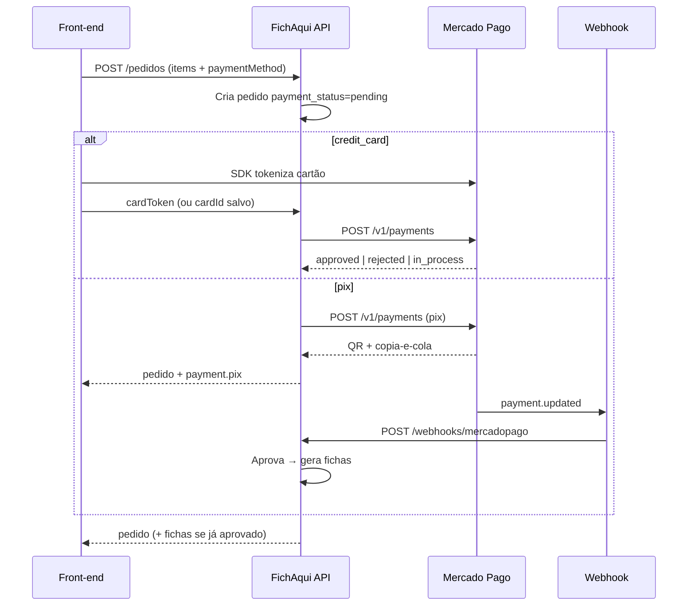
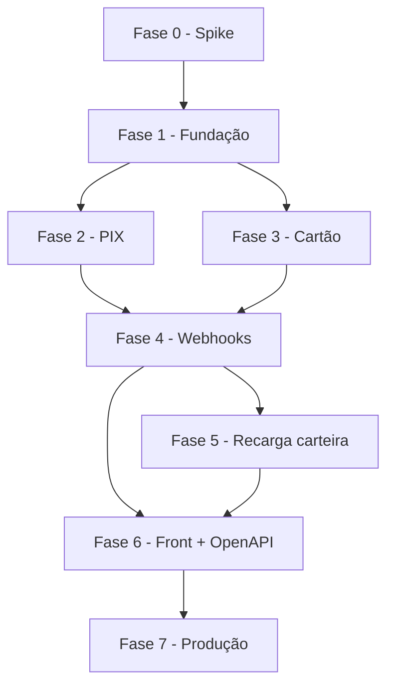

# Roadmap — Integração Mercado Pago

Plano de implementação para substituir o **stub de pagamento** atual por integração real com o [Mercado Pago](https://www.mercadopago.com.br/developers), mantendo o contrato do [`backend-integration-guide.md`](../../FichAqui-FrontEnd/backend-integration-guide.md) e evoluindo o checkout para fluxos assíncronos (PIX) e tokenizados (cartão).

**Pré-requisito:** roadmap de integração backend (fases 0–12) concluído — rotas de domínio, carteira (leitura) e checkout stub já existem.

**Referências:** `CONTEXT.md`, `docs/roadmap-backend-integration.md`, ADR-0002, [Mercado Pago Developers](https://www.mercadopago.com.br/developers/pt/docs).

**Última revisão:** 2026-06-17.

---

## Estado atual (baseline de pagamentos)

| Item                                 | Situação hoje                                                            |
| ------------------------------------ | -------------------------------------------------------------------------- |
| `POST /api/events/{eventId}/pedidos` | Aceita `credit_card`, `pix`, `wallet`                                      |
| Cartão                              | Valida `cardId` local; retorna `payment_status: paid` sem cobrança real   |
| PIX                                  | Retorna `payment_status: pending`; **sem QR**; fichas são geradas na hora |
| Carteira                             | Debita saldo local (`carteiras.balance`); sem recarga via gateway          |
| `cartoes_salvos.gateway_token`       | Coluna existe; não populada pelo MP                                       |
| Webhooks                             | Inexistentes                                                               |
| Tabela `pagamentos`                  | Inexistente (só colunas em `pedidos`)                                     |

**Mudança arquitetural central:** com PSP real, **fichas só devem ser geradas quando o pagamento estiver aprovado** (`approved`). Hoje o `PedidoCheckoutService` gera fichas na mesma transação do checkout — isso precisa ser refatorado na Fase 2.

---

## Decisões de produto (fechar antes da Fase 1)

| #   | Tema                | Recomendação                                                                                                                     |
| --- | ------------------- | ---------------------------------------------------------------------------------------------------------------------------------- |
| D1  | Modelo MP           | **Checkout API / Payments API** (não Bricks embedded no backend); front usa **SDK JS** para tokenizar cartão                     |
| D2  | PIX                 | Cobrança via `POST /v1/payments` com `payment_method_id: pix`; exibir `point_of_interaction.transaction_data` (QR + copia-e-cola) |
| D3  | Cartão salvo       | Token do MP (`card_id` do customer) em `cartoes_salvos.gateway_token`; nunca persistir PAN/CVV                                     |
| D4  | Carteira pré-paga  | Fase opcional: recarga via PIX/cartão creditando `carteiras.balance`; checkout `wallet` continua local                            |
| D5  | Split / marketplace | **Fora do MVP** — repasse para organizadores em fase futura (`application_fee`, OAuth por organizador)                             |
| D6  | Ambiente            | Sandbox (`TEST-...`) em dev; credenciais de produção só via secrets                                                             |
| D7  | Idempotência       | `X-Idempotency-Key` em toda criação de pagamento MP; chave = `pedido_id` ou ULID dedicado                                        |

---

## Visão do fluxo alvo



---

## Fases de entrega

Ordem sugerida: fundação → PIX (assíncrono) → cartão → webhooks → carteira → front → produção.

---

### Fase 0 — Alinhamento e spike técnico

**Objetivo:** validar credenciais, SDK e fluxo sandbox antes de alterar schema.

| #   | Entrega                | Detalhes                                                                                                                                   |
| --- | ---------------------- | ------------------------------------------------------------------------------------------------------------------------------------------ |
| 0.1 | Conta e app MP         | Criar aplicação em [Suas integrações](https://www.mercadopago.com.br/developers/panel/app); obter `PUBLIC_KEY` e `ACCESS_TOKEN` (test) |
| 0.2 | Spike manual           | `curl`/Postman: criar pagamento PIX e cartão no sandbox; anotar payloads e status                                                         |
| 0.3 | ADR-0003               | Documentar decisão MP (Payments API, tokenização no front, quando gerar fichas)                                                         |
| 0.4 | Variáveis de ambiente | `MP_ACCESS_TOKEN`, `MP_PUBLIC_KEY`, `MP_WEBHOOK_SECRET`, `MP_WEBHOOK_URL`                                                                  |

**Critério de pronto:** pagamento PIX de R$ 1,00 aprovado manualmente no sandbox; ADR publicado.

**Estimativa:** 0,5–1 dia.

---

### Fase 1 — Fundação no backend

**Objetivo:** camada de domínio de pagamento desacoplada do checkout.

| #   | Entrega                            | Detalhes                                                                                                                                          |
| --- | ---------------------------------- | ------------------------------------------------------------------------------------------------------------------------------------------------- |
| 1.1 | Pacote HTTP                        | `mercadopago/dx-php` ou client Guzzle interno em `app/Services/MercadoPago/`                                                                      |
| 1.2 | Config                             | `config/mercadopago.php` + binding no container                                                                                                   |
| 1.3 | Migration `pagamentos`             | `id`, `pedido_id`, `user_id`, `mp_payment_id`, `method`, `amount`, `status`, `status_detail`, `idempotency_key`, `raw_payload` (json), timestamps |
| 1.4 | Model `Pagamento` + enum de status | Mapear status MP → `pending`, `approved`, `rejected`, `cancelled`, `refunded`                                                                     |
| 1.5 | `PaymentGateway` (interface)       | `createPixPayment()`, `createCardPayment()`, `getPayment()`, `refund()`                                                                           |
| 1.6 | `MercadoPagoGateway`               | Implementação concreta                                                                                                                          |
| 1.7 | Testes com mock HTTP               | `Http::fake()` — sem chamar MP em CI                                                                                                              |

**Critério de pronto:** serviço cria pagamento fake em teste; migration aplicada.

**Estimativa:** 2–3 dias.

---

### Fase 2 — Checkout assíncrono e PIX

**Objetivo:** PIX real com QR; pedido pendente até confirmação; fichas só após `approved`.

| #   | Entrega                               | Detalhes                                                                                                                               |
| --- | ------------------------------------- | -------------------------------------------------------------------------------------------------------------------------------------- |
| 2.1 | Refatorar `PedidoCheckoutService`     | Separar: (1) criar pedido + itens reservados, (2) iniciar pagamento, (3) `FichaGenerationService` só após aprovação                |
| 2.2 | Status do pedido                      | Novos valores sugeridos: `payment_status`: `pending` \| `paid` \| `failed`; `pedidos.status` permanece `available` só após pagamento |
| 2.3 | Resposta checkout PIX                 | Incluir DTO `payment`: `{ status, pixQrCode, pixCopyPaste, expiresAt, paymentId }`                                                     |
| 2.4 | `GET /api/pedidos/{pedidoId}/payment` | Consultar estado atual (polling leve pelo front)                                                                                       |
| 2.5 | Expiração PIX                       | Job agendado: cancelar pedidos `pending` após TTL (ex.: 30 min)                                                                       |
| 2.6 | Testes Feature                        | Checkout PIX retorna QR; sem fichas até webhook/poll aprovar                                                                          |

**Request (evolução do contrato):**

```json
{
    "items": [{ "offeringId": "...", "variantId": "carne", "quantity": 2 }],
    "paymentMethod": "pix"
}
```

**Response (PIX pendente):**

```json
{
    "id": "pedido-...",
    "paymentStatus": "pending",
    "fichas": [],
    "payment": {
        "id": "pagamento-...",
        "method": "pix",
        "pixQrCode": "data:image/png;base64,...",
        "pixCopyPaste": "00020126...",
        "expiresAt": "2026-06-17T19:00:00Z"
    }
}
```

**Critério de pronto:** fluxo PIX sandbox ponta a ponta com geração de fichas após aprovação simulada.

**Estimativa:** 3–4 dias.

---

### Fase 3 — Cartão de crédito tokenizado

**Objetivo:** cobrança real com cartão; suporte a cartão novo e salvo.

| #   | Entrega                           | Detalhes                                                                                                       |
| --- | --------------------------------- | -------------------------------------------------------------------------------------------------------------- |
| 3.1 | Front: Mercado Pago JS SDK        | Cardform / Payment Brick — obter `token` no browser (PCI no MP)                                                |
| 3.2 | Checkout cartão                  | Aceitar `cardToken` (one-shot) **ou** `cardId` (cartão salvo local → `gateway_token`)                         |
| 3.3 | `POST /api/user/cards`            | Salvar cartão: recebe `cardToken`, cria Customer + Card no MP, persiste `gateway_token`, `last_four`, `brand` |
| 3.4 | `DELETE /api/user/cards/{cardId}` | Remove local + card no MP                                                                                      |
| 3.5 | Pagamento síncrono               | Cartão aprovado → fichas na mesma resposta; `rejected` → pedido `failed`, sem fichas                          |
| 3.6 | 3DS / `in_process`                | Tratar status intermediário; opcional: redirect ou poll                                                       |

**Critério de pronto:** pagamento com cartão de teste MP (`APRO`) gera fichas; cartão salvo reutilizável.

**Estimativa:** 3–5 dias (inclui ajuste no front).

---

### Fase 4 — Webhooks e reconciliação

**Objetivo:** confirmação confiável de PIX e atualizações assíncronas.

| #   | Entrega                          | Detalhes                                                                       |
| --- | -------------------------------- | ------------------------------------------------------------------------------ |
| 4.1 | `POST /api/webhooks/mercadopago` | Rota pública (sem Sanctum); validar assinatura `x-signature` / `x-request-id` |
| 4.2 | `WebhookProcessor`               | Idempotente por `mp_payment_id`; atualiza `pagamentos` e `pedidos`             |
| 4.3 | Geração de fichas no webhook   | Se `approved` e pedido sem fichas → `FichaGenerationService`                   |
| 4.4 | Log estruturado                  | Canal `payments`; incluir `pedido_id`, `mp_payment_id`, `status`               |
| 4.5 | Command de reconciliação       | `php artisan payments:reconcile` — busca pagamentos `pending` > N min no MP    |
| 4.6 | Testes                           | Payloads de exemplo MP em `tests/Fixtures/MercadoPago/`                        |

**Critério de pronto:** PIX aprovado no app MP dispara webhook e materializa fichas sem polling manual.

**Estimativa:** 2–3 dias.

---

### Fase 5 — Carteira pré-paga (recarga)

**Objetivo:** permitir saldo real creditado via MP (opcional para MVP, recomendado antes de produção).

| #   | Entrega                          | Detalhes                                                                                |
| --- | -------------------------------- | --------------------------------------------------------------------------------------- |
| 5.1 | `POST /api/user/wallet/recharge` | Body: `{ amount, paymentMethod, cardToken? }` — cria `pagamentos` tipo `wallet_topup`   |
| 5.2 | Crédito atômico                | Webhook `approved` → incrementa `carteiras.balance` + registro em `carteira_movimentos` |
| 5.3 | Checkout `wallet`                | Manter débito local; validar saldo antes de confirmar pedido                           |
| 5.4 | Extrato opcional                 | `GET /api/user/wallet/transactions`                                                     |

**Critério de pronto:** recarga PIX/cartão aumenta saldo; compra com `wallet` debita e gera fichas.

**Estimativa:** 2–3 dias.

---

### Fase 6 — Contrato API, OpenAPI e front-end

**Objetivo:** documentar e integrar o front ao novo fluxo de pagamento.

| #   | Entrega                                  | Detalhes                                                          |
| --- | ---------------------------------------- | ----------------------------------------------------------------- |
| 6.1 | Atualizar `backend-integration-guide.md` | Seção Pagamentos: PIX assíncrono, `cardToken`, polling/webhook |
| 6.2 | `public/openapi.yaml`                    | Schemas `Payment`, `PixPaymentData`, rotas cards/recharge/webhook |
| 6.3 | Front: checkout PIX                      | Tela QR + copia-e-cola + poll `GET .../payment` ou SSE futuro     |
| 6.4 | Front: checkout cartão                  | Integrar MP SDK; remover mocks de cartão                         |
| 6.5 | `docs/integration-checklist-frontend.md` | Marcar itens de pagamento                                         |
| 6.6 | Teste E2E                                | `CheckoutPixE2ETest` com HTTP fake + webhook simulado             |

**Critério de pronto:** front em sandbox completa compra PIX e cartão sem mocks de pagamento.

**Estimativa:** 3–4 dias.

---

### Fase 7 — Produção, segurança e observabilidade

**Objetivo:** ir ao ar com confiança.

| #   | Entrega            | Detalhes                                                                   |
| --- | ------------------ | -------------------------------------------------------------------------- |
| 7.1 | Secrets            | Tokens MP só em env/secret manager; nunca no repositório                 |
| 7.2 | HTTPS obrigatório | Webhook URL pública com TLS                                               |
| 7.3 | Rate limit         | Webhook e `POST /pedidos`                                                  |
| 7.4 | Alertas            | Pagamentos `pending` > 1h, webhooks com falha, divergência reconcile      |
| 7.5 | Runbook            | `docs/runbooks/mercado-pago.md` — incidentes, estorno manual, contato MP   |
| 7.6 | Homologação      | Checklist sandbox → produção (credenciais, webhook, valor mínimo, CNPJ) |

**Critério de pronto:** primeiro pagamento real em produção monitorado; runbook publicado.

**Estimativa:** 1–2 dias.

---

### Fase 8 — Pós-MVP (opcional)

| #   | Entrega                | Notas                                                                  |
| --- | ---------------------- | ---------------------------------------------------------------------- |
| 8.1 | Estorno / cancelamento | `POST /api/pedidos/{id}/refund` → API MP; invalidar fichas `available` |
| 8.2 | Marketplace / split    | OAuth por organizador; `marketplace_fee` para paróquia                |
| 8.3 | Assinaturas / carnê   | Fora do escopo festa junina — avaliar depois                           |
| 8.4 | Nota fiscal            | Integração fiscal separada                                           |

---

## Matriz de rastreabilidade (novas rotas)

| Rota                                                          | Fase |
| ------------------------------------------------------------- | ---- |
| `POST /api/events/{eventId}/pedidos` (evolução PIX/cartão) | 2, 3 |
| `GET /api/pedidos/{pedidoId}/payment`                         | 2    |
| `POST /api/webhooks/mercadopago`                              | 4    |
| `POST /api/user/cards`                                        | 3    |
| `DELETE /api/user/cards/{cardId}`                             | 3    |
| `POST /api/user/wallet/recharge`                              | 5    |
| `GET /api/user/wallet/transactions`                           | 5    |

Rotas existentes **inalteradas** no contrato base: `GET /api/user/wallet`, histórico de pedidos/fichas, consumo na barraca.

---

## Dependências entre fases



**Paralelizável:** Fase 3 (cartão) pode avançar em paralelo com Fase 2 após Fase 1, mas **webhooks (Fase 4)** deve unificar ambos.

---

## Estimativa de esforço

| Fase | Complexidade | Dias (1 dev) |
| ---- | ------------ | ------------ |
| 0    | Baixa        | 0,5–1        |
| 1    | Média       | 2–3          |
| 2    | Alta         | 3–4          |
| 3    | Alta         | 3–5          |
| 4    | Média–alta  | 2–3          |
| 5    | Média       | 2–3          |
| 6    | Média       | 3–4          |
| 7    | Baixa        | 1–2          |

**Total MVP (fases 0–7, sem 8):** ~17–25 dias focados.

---

## Riscos

| Risco                                         | Mitigação                                                            |
| --------------------------------------------- | ---------------------------------------------------------------------- |
| Fichas geradas antes do pagamento (bug atual) | Refatorar na Fase 2; teste que asserta `fichas: []` enquanto `pending` |
| Webhook perdido                               | Polling + job `payments:reconcile`                                     |
| PCI — armazenar cartão                       | Só tokens MP; SDK no front                                            |
| PIX expirado e pedido órfão                 | TTL + job de cancelamento                                              |
| Divergência saldo carteira                   | `carteira_movimentos` append-only + transação DB                     |
| Taxas MP não repassadas                      | Documentar no preço; split na Fase 8                                  |

---

## Definition of Done (por entrega de pagamento)

- [ ] Interface `PaymentGateway` coberta por testes com mock HTTP
- [ ] Idempotência em criação de pagamento
- [ ] Webhook validado e processado de forma idempotente
- [ ] Fichas geradas **somente** em `approved`
- [ ] Entrada no `openapi.yaml` e guia do front
- [ ] Logs sem dados sensíveis (PAN, CVV, token completo)
- [ ] Testado em sandbox MP antes de produção

---

## Próximo passo imediato

Iniciar **Fase 0**: criar app no painel Mercado Pago, executar spike PIX no sandbox e redigir **ADR-0003** (quando gerar fichas + escolha Payments API).
